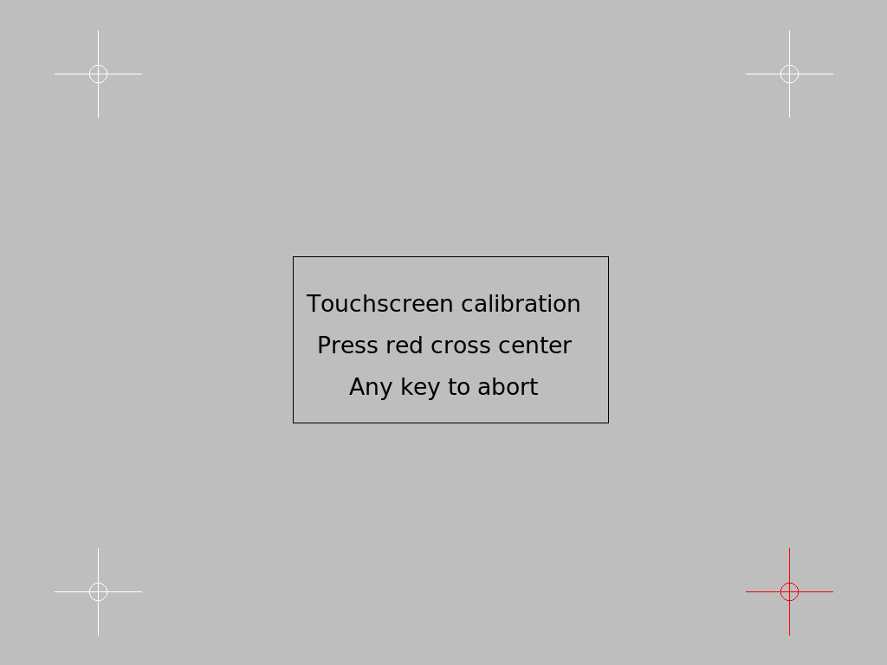

xorg_calibrator
===============

Touch screen calibration utility for X.Org X Window System.
Successor of xinput_calibrator.
Uses x.org
https://www.x.org/releases/current/doc/man/man5/xorg.conf.5.xhtml[Option "TransformationMatrix"]
and has different calibrating algorithm(see <<acknowledgments>>).



The program

* finds calibratable device
* resets the device calibration to default
* shows a screen asking to touch 4 points marked by a cross and collects touch coordinates
* calculates transformation matrix
* set the transformation matrix to the device
* prints X.Org Option "TransformationMatrix" with the transformation matrix
* optionally write file containing X.Org Option "TransformationMatrix" with the transformation matrix

To abort calibration press any key.
The message in the center of the screen can be set with "message" option.

X.Org will reset calibration to default after restart.
To make calibration permanent file saved by xorg_calibrator can be put to location like
/usr/share/X11/xorg.conf.d/99-calibration.conf

The file content shall look like this:
```
Section "InputClass"
        Identifier      "calibration"
        MatchProduct    "VirtualPS/2 VMware VMMouse"
        Option  "TransformationMatrix"  "0.999153 -0.003339 -0.000184 -0.005000 0.998305 0.003031 0.000000 0.000000 1.000000"
EndSection

```
== Usage examples

```
./xorg_calibrator output_filename=/usr/share/X11/xorg.conf.d/99-calibration.conf

./xorg_calibrator message="Hello user!\nYou know what to do.\nGood luck!"
```

If there are multiple calibratable devices and xorg_calibrator
selects wrong one "list" command can be used to find device to calibrate:

```
./xorg_calibrator list
```
Output like this:
```
id: 4 "Virtual core XTEST pointer" calibratable:0
id: 5 "Virtual core XTEST keyboard" calibratable:0
id: 6 "Power Button" calibratable:0
id: 7 "QEMU QEMU USB Tablet" calibratable:1
id: 8 "AT Translated Set 2 keyboard" calibratable:0
id: 9 "VirtualPS/2 VMware VMMouse" calibratable:0
id: 10 "VirtualPS/2 VMware VMMouse" calibratable:1
```
If no 'device_name' or 'device_id' option given the last calibratable device is selected.
So id: 10 "VirtualPS/2 VMware VMMouse" have been tried already.
Lets try id: 7 "QEMU QEMU USB Tablet":

```
./xorg_calibrator device_name="QEMU QEMU USB Tablet"
```
Same with id:
```
./xorg_calibrator device_id=7
```
Device ids can change after reboot or if you plugin/unplug some input
device like mouse or keyboard.

== Options

* list - list calibratable devices 
* device_name - name of the device to calibrate
* device_id - id of the device to calibrate
* fake - use fake device for test
* reset - reset calibration to default
* h or help - output this help message
* screen_num - number of the screen to calibrate
* message - message to show on calibration screen. Strings separated by "\n". UTF8 is supported
* output_filename - name of the file to write calibration config to
* verbose - print a lot of log messages"
* timeout - seconds to wait for user touches. Default - wait forever

If no 'device_name' or 'device_id' option given the last calibratable device is selected.

== Build

to build run:
```
make
```

=== Dependencies:

A compiler that supports C++11.

Packages: 
libx11-dev
libxi-dev
libfreetype-dev

== Acknowledgments [[acknowledgments]]
I would like to thank authors of
xinput calibrator
https://github.com/tias/xinput_calibrator
and authors of the
algorithm in matrix.pl by Frank Rysanek and Petr Mikse
http://support.fccps.cz/download/adv/frr/matrix_calibrator/matrix_calibrator.htm
